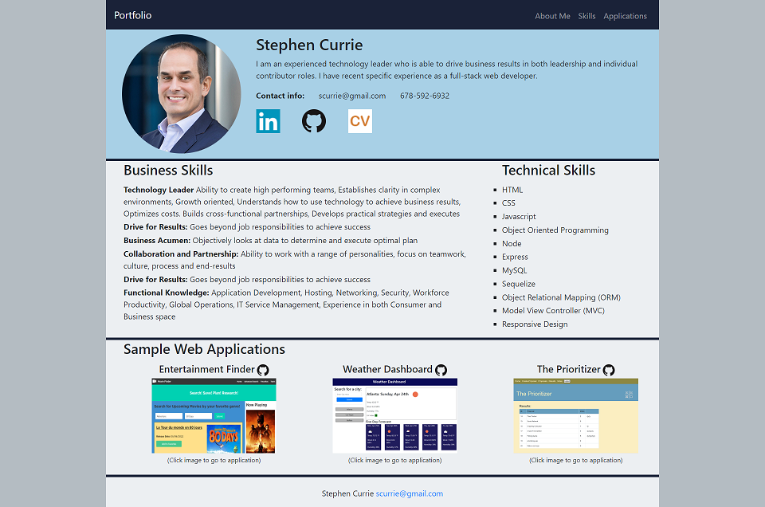

# Stephen Currie's Web Application Portfolio

## Description

This page is a web portfolio for Stephen Currie.  The look and feel and content of this page will get updated periodically as new applications get built and/or when the page can be improved visually.

The "contact me" form is not working at the moment, but that will get updated shortly.  

The responsiveness will also get improved to display better on various screen sizes.

Stephen can always be reached directly at scurrie@gmail.com

## Table of Contents

- [Screenshots and Links](#screenshots)
- [Acceptance Criteria](#acceptance)
- [What I Learned](#learned)
- [Credits](#credits)

## ScreenShots

Below is a screen shot of the web application:

The page is live on [GitHub Pages](https://stephencurrie.github.io/portfolio/)

The code is in the [GitHub Repository](https://github.com/stephencurrie/portfolio)

## Acceptance

The following are things accomplished by this portfolio site:

- [x] The page uses bootstrap and custom colors
- [x] The page uses a mobile first design (I still need to clean some of this up)
- [x] The page links to a pdf file for my resume
- [x] The page links to 3 applications I have either built or builts as a team

## Learned

The following is a list of things I learned:

- More experience using bootstrap, including building a hamburger menu
- More experiecne with CSS and specifically, media queries for responsivenss on different screens

## Credits

On the entertainment finder application, I worked with a team that includded:
- Adam Brock - Javascript, Technical Manager
- Da Eun Kim - Javascript, Layout
- Harris Al - Javascript
- Ron Crawford - CSS, Javascript
- nStephen Currie - Layout, Project Manager